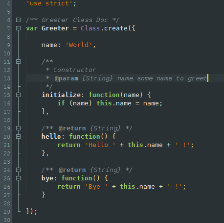

Obsidian Color Theme for NetBeans IDE
=============

This is plugin that adds Obsidian code coloring (highlighting) Theme for [NetBeans IDE](https://netbeans.org/).

Theme contains coloring for Java, JavaScript, PHP, CSS, HTML, XML, Groovy, Python, TypeScript and some other.

After installation go to "Tools" -> "Options" -> "Fonts & Colors" -> "Profile", choose "Obsidian Color Profile" and click "OK".

This color theme uses "DejaVu Sans Mono" font. If your system does not have this font installed you can download it from [dejavu-fonts.org](http://dejavu-fonts.org/) or use different font by choosing it in "Tools" -> "Options" -> "Fonts & Colors" -> "All Languages" -> "Default" category -> "Font".

This plugin should work with any version of NetBeans IDE newer than or equal to version 8.0 (should work with nightly builds also). If you do not see it in NetBeans Update Center you can still get it by downloading from release page or [plugin portal] (http://plugins.netbeans.org/plugin/57669/obsidian-color-theme) and installing by going to "Tools" -> "Plugins" -> "Downloaded" -> "Add Plugins..." choose downloaded file and press "Install".
